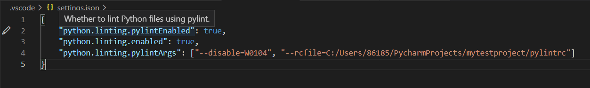
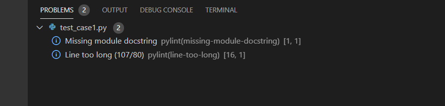
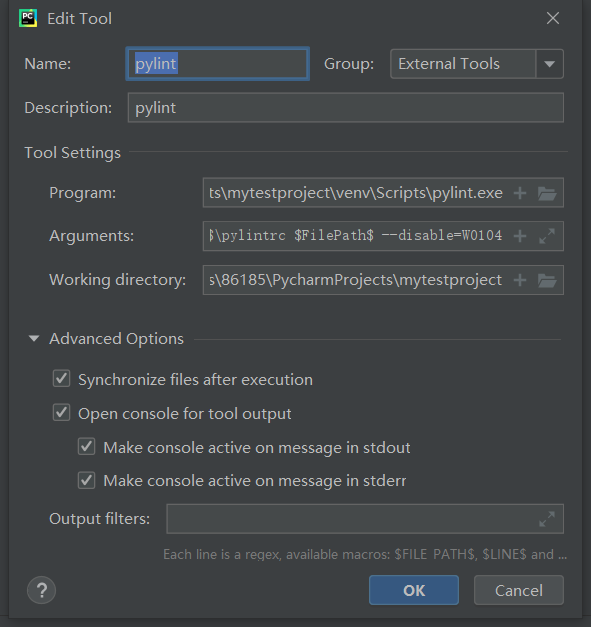
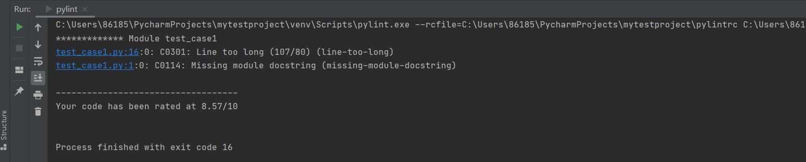

## 0 背景
================================

@作者：[鱼丸粗面](https://github.com/MichaelYin1994)（zhuoyin94@163.com）

@参考文献：
- [Google Python Style Guide](https://google.github.io/styleguide/pyguide.html)
- [python-web-guide](https://python-web-guide.readthedocs.io/zh/latest/codingstyle/codingstyle.html)
- [编写可读代码的艺术](https://book.douban.com/subject/10797189/)：Duncan S P. The Art of Readable Code[J]. Software Quality Professional, 2012, 14(2): 47.
- [代码整洁之道](https://book.douban.com/subject/4199741/)：Martin R C. Clean code: a handbook of agile software craftsmanship[M]. Pearson Education, 2009.

@致谢 & 参考：
- [谷歌Python代码风格指南-中文翻译](https://github.com/shendeguize/GooglePythonStyleGuideCN)
- [Google 开源项目风格指南 (中文版)](https://github.com/zh-google-styleguide/zh-google-styleguide)
- [lzj0322](https://github.com/lzj0322)

Python是目前主流的脚本语言，被用于Web开发、网络爬虫、数据分析等方方面面。这本指南主要包含的是针对**Python 3.x**的编程准则，用于规范团队的风格，便于新的编码人员快速融入团队，也为Python的代码审查提供一个基础的标准。后续如无特殊说明，**Python**均指**Python 3.x**。

本指南总共包含5个章节：
- **代码检视工具**：阐明了如何利用常见的IDE（例如Visual Studio Code，或者Pycharm）对代码进行检查。
- **基本命名规则**：规定了针对Python编码过程中，包（Packages）、模块（Modules）、类（class）等的命名规范与风格，并包含了一系列的具体建议。
- **Python编码风格规范**：规定了形成Python风格的代码的规范。
- **Python编码语言规范**：规定了利用Python语言编码过程中的注意事项。
- **单元测试自测规范**：待完善。

在本指南中，后缀有**强制**字样的章节，建议团队严格统一按照此条执行；后缀有**建议**字样的章节，建议团队尽量执行，但不做强制要求。

本指南的撰写，参考了前述的参考文献。其中主要脱胎于Google的[Google Python Style Guide](https://google.github.io/styleguide/pyguide.html)与[编写可读代码的艺术](https://book.douban.com/subject/10797189/)。但是为了团队实施的便捷性，删去了一些章节的内容，例如针对Python 2.x的后向兼容措施、针对Python 3.x的类型注释措施等，仅保留了一些笔者认为至关重要的部分，因此请读者在阅读时多多留心。

基于本指南，我们开源了一个自然语言处理的[小型项目](https://github.com/MichaelYin1994/textrank)作为该指南的模板项目，基于本指南的一切命名、注释、单元测试等规范可参考该项目的编码实现。

**请注意！针对本指南的运行、复制、分发、学习、修改与改进请注明出处！**

---

## 1 代码检视工具
================================

### 1.1 Lint（强制）
请使用该[pylintrc](https://github.com/MichaelYin1994/textrank/blob/master/pylintrc)对你的代码运行`pylint`。

`pylint`是一个在Python源代码中查找bug的工具。对于C和C++这样的不那么动态的（强制类型）语言，这些bug通常由编译器来捕获。由于Python的动态特性，`pylint`生成的有些警告可能不对，不过伪告警应该相对较少。

但是需要注意的是，我们不应完全遵照`pylint`的评审结果进行编码，更应该利用其优势，在某些场景下可以抑制警告，或者忽略警告。抑制不准确的警告，以便能够将其他警告暴露出来。你可以通过设置一个行级别的注释来抑制警告。例如:
```Python
dict = 'something awful'  # Bad Idea... pylint: disable=redefined-builtin
```
`pylint`警告是以符号名(如`empty-docstring`)来标识的。如果警告的符号名不够见名知意，那么请对其增加一个详细解释。采用这种抑制方式的好处是我们可以轻松查找抑制并回顾它们。

你可以使用命令`pylint --list-msgs`来获取pylint告警列表。你可以使用命令 `pylint --help-msg=C6409`，以获取关于特定消息的更多信息。

在函数体中`del`未使用的变量可以消除参数未使用告警。但是总要记得要加一条注释说明你为何`del`它们，注释使用"Unused"就可以，例如：
```Python
def viking_cafe_order(spam, beans, eggs=None):
    del beans, eggs  # Unused by vikings.
    return spam + spam + spa
```
其他消除这个告警的方法还有使用`_`标识未使用参数，或者给这些参数名加上前缀 `unused_`，或者直接把它们赋值给`_`。这些方法都是允许的，但是已经不再被鼓励使用。前两种方式会影响到通过参数名传参的调用方式，而最后一种并不能保证参数确实未被使用。

--------------------
### 1.2 pylint在Visual Studio Code中的配置方法
pylint在Windows下的Visual Studio Code中的配置方法如下所示：
* 在Visual Studio Code的命令面板（`Ctrl+Shift+P`）中输入`Python: Select Linter`，并选择`pylint`
* 如果pylintrc文件不在项目中，需要在项目的settings.json文件中添加参数指定，例如`"python.linting.pylintArgs": ["--disable=W0104", "--rcfile=C:/Users/86185/PycharmProjects/mytestproject/pylintrc"]`
* 保存`.py`文件时，会自动运行linting并输出检测结果。

其中，settings.json文件如下图：


pylint运行后的提示结果如下图：


--------------------
### 1.3 pylint在Pycharm中的配置方法
pylint在Windows下的Pycharm中的配置方法如下所示：
* 在你的Pycharm环境中安装pylint。
* 将pylintrc文件放入项目根目录或指定位置。
* `File` -> `Settings` -> `Tools` -> `External Tools`，点加号进入`Create Tool`界面。
* `Name`和`Description`可填写pylint。
* `Program`填写pylint安装的路径，在Windows下，可以使用`where`指令找到：
    ```Bash
    where pylint
    ```
* `Argument`填写运行pylint的参数，比如指定的pylintrc配置文件，例如`--rcfile=$FileDir$\pylintrc $FilePath$`
* `Working directory`填写工作目录，例如`$FileDir$`
* 使用时右键点击项目或文件，在`External Tools`项中选择上面创建的`pylint`

Create Tool如下图：


pylint运行结果如下图：


更详细的相关资料，包括linux下的pylintrc环境配置，可参见[如何使用PyCharm运行Pylint](https://www.itranslater.com/qa/details/2582431254444508160)。

--------------------

## 2 基本命名规则
================================

### 2.1 基本命名约定（强制）
模块名命名范式：`module_name`，包名命名范式：`package_name`，类名命名范式：`ClassName`，方法名命名范式：`method_name`，异常名命名范式：`ExceptionName`，函数名命名范式：`function_name`，全局常量命名范式：`GLOBAL_CONSTANT_NAME`，全局变量命名范式：`global_var_name`，实例命名范式：`instance_var_name`，函数命名范式：`function_parameter_name`，局部变量命名范式`local_var_name`。

Python之父Guido的命名指导建议：
| **类型** | **公共** | **内部** |
| --- | --- | --- |
| 包 | `lower_with_under` |  |
| 模块 | `lower_with_under` | `_lower_with_under` |
| 类 | `CapWords` | `_CapWords` |
| 异常 | `CapWords` |  |
| 函数 | `lower_with_under()` | `_lower_with_under()` |
| 全局/类常量 | `CAPS_WITH_UNDER` | `_CAPS_WITH_UNDER` |
| 全局/类变量 | `lower_with_under` | `_lower_with_under` |
| 实例变量 | `lower_with_under` | `_lower_with_under`(受保护) |
| 方法名 | `lower_with_under()` | `_lower_with_under()`(受保护) |
| 函数/方法参数 | `lower_with_under` |  |
| 局部变量 | `lower_with_under` |  |

命名过程中，应当注意：
* internal表示仅模块内可用、或者类内保护的或者私有的。
* 单下划线（`_`）开头表示该模块变量与方法是被保护的。双下划线（`__`也就是"dunder"）开头的实例变量或者方法表示类内私有（使用命名修饰），我们不鼓励使用，因为这会对可读性和可测试性有影响，并且不会使得变量`真正`的私有。
* 将相关的类和顶级函数放在同一个模块里。不像Java，没必要限制一个类一个模块。
* 对类名使用大写字母开头的单词（如CapWords），但是模块名应该用小写加下划线的方式（如lower_with_under.py）。尽管已经有很多现存的模块使用类似于CapWords.py这样的命名，但现在已经不鼓励这样做，因为如果模块名碰巧和类名一致，这会让人困扰（例如：是`import StringIO`还是`from StringIO import StringIO`？二者会让人产生困扰）。
* 在*unittest*方法中可能是`test`开头来分割名字的组成部分，即使这些组成部分是使用大写字母驼峰式的。典型的可能模式像：`test<MethodUnderTest>_<state>`，例如`testPop_EmptyStack`是可以的。对于测试方法的命名没有明确的正确方法。
* Python文件拓展名必须为`.py`，不可以包含`-`（中划线），这保证了能够被正常import和单元测试。

--------------------
### 2.2 命名过程中应当避免的情况（强制）
命名过程中应当避免以下的一系列情况：
* 单字符名字，除非是以下特殊案例：
  * 计数器或者迭代器（例如`i, j, k, v`等等）。
  * 作为`try/except`中异常声明的`e`。
  * 作为`with`语句中文件对象的`f`。

    请注意不要滥用单字符命名。一般来说，变量名的描述程度应当与命名空间的范围成比例。例如对于变量`i`应该在5行代码块以内有效，如果对于多段嵌套代码含义则显得过于模糊。
* `-`横线，不应出现在任何包名或模块名内。
* `__double_leading_and_trailing_underscore__` 首尾都双下划线的名字，这种名字是Python的内置保留名字。
* 有冒犯性质的名字，例如不文明词汇，侮辱性词汇。
* 空泛的名字。好的名字应当描述变量的目的或者它承载的值。例如某个函数的返回值为输入数组`x`的算平方和，那么`sum_squares`比`retval`这样的名字要好。因此需要尽量避免使用`tmp`、`retval`、`foo`这样的词。

--------------------
### 2.3 命名过程中的应当尽量遵守的准则（建议）
在命名过程中，应当尽量遵守以下的一系列准则：
* 名字不让人产生误解。阅读你代码的人应该理解你的本意，并且不会产生歧义。使用某一个名字之前，要吹毛求疵一点，可以想象一下你的名字会被误解成什么。最好的名字是不会存在误解。例如在写一段数据库操作的代码的时候，采用如下的代码
    ```Python
    results = database.all_objects.filter("year <= 2011")
    ```
    这里的问题是，`filter`是个二义性的单词。我们此处不清楚这个词在这里到底是“挑出”还是“除去”。因此此处最好避免采用`filter`这个词。
* 使用专业的单词。例如不用`get`，而是根据语境使用`fetch`或者`download`可能会更好，再例如`size()`在树中应该用`height()`表示高度，`num_nodes()`表示节点数，用`memory_bytes()`表示内存中所占的空间。但是这由编码的环境所决定，不需要严格遵守。
* 依据使用的语境，使用更有表现力的词汇，例如：

    | 单词   |  更多选择                                     |
    | ----- | ---------------------------------------- |
    | send  | deliver、dispatch、 announce、 distribute、route |
    | find  | search、extract、locate、recover            |
    | start | launch、create、begin、open                 |
    | make  | create、set up、build、generate、compose、add、new |
* 命名过程中，尽量为变量名附加更多的信息。一个变量就像是一个小小的注释，因此如果关于某个变量如果有什么重要信息，那么值得将额外的“词”添加进名字里。例如如果一个`id`字符串是十六进制的，可以命名为`hex_id`。

--------------------

## 3 Python注释和文档字符串
================================

### 3.1 文档字符串（强制）
Python使用*文档字符串（docstrings）*来为代码生成文档。文档字符串是包，模块，类或函数里的第一块语句。这些字符串可以通过对象的`__doc__`成员被自动提取，并且被`pydoc`所用（尝试在模块上运行`pydoc`来看看效果）。我们对文档字符串的惯例是使用三重双引号`"""`（可参考[PEP-257](https://www.google.com/url?sa=D&q=http://www.python.org/dev/peps/pep-0257/)）。

一个文档字符串应该这样组织：一行概述，该行以句号，问号或者感叹号作为结尾（单行不能超过80个字符）；接着是一行空行，随后是剩下的文档字符，这些剩下的文档字符串应当与第一行的第一个引号对齐。下面有更多文档字符串的格式化规范。

--------------------
### 3.2 针对模块的文档字符串（强制）
针对模块的文档字符串而言，文档应该以文档字符串开头，并描述模块的内容和使用方法。例如：
```Python
"""A one line summary of the module or program, terminated by a period.

Leave one blank line.  The rest of this docstring should contain an
overall description of the module or program.  Optionally, it may also
contain a brief description of exported classes and functions and/or usage
examples.

  Typical usage example:

  foo = ClassFoo()
  bar = foo.FunctionBar()
"""
```

--------------------
### 3.3 针对函数与方法的文档字符串（强制）
在本节，"函数"所指包括方法，函数或者生成器。

函数必须具有文档字符串（docstring），除非是以下情况：
* 函数对于外部不可见
* 非常短小的函数，例如匿名函数
* 简单明了

文档字符串应该给出足够的信息，在不需要阅读函数代码的情况下说清如何调用该函数。文档字符串应该是叙事体（`"""Fetches rows from a Bigtable."""`）的而非命令式的（`"""Fetch rows from a Bigtable."""`），除非是`@property`。文档字符串应描述函数的调用语法和其意义，而非它实现的细节。对于比较有技巧性的代码，代码旁边加注释比文档字符串的方法要更合适。

覆盖基类的子类方法应有一个类似于`See base class`的简单注释来指引读者到基类方法的文档注释。这是因为子类方法没有必要在很多地方重复已经存在的基类的文档。但是，如果子类覆写的方法的行为与基类方法的行为有很大不同，那么文档字符串中应该说明这些细节（例如，文档中说明副作用），覆写方法的文档字符串至少应该包含这些细节信息。

关于函数的几个特定的方面应该在特定的小节中进行描述记录，这几个方面如下所述：每节应该以一个标题行开始，标题行以冒号结尾，每一节除了首行外，都应该以4个空格缩进并在整个文件内保持一致。如果函数名和签名足够给出足够信息并且能够刚好被一行文档字符串所描述，那么可以忽略这些节；并应该包含以下信息：

**Args:**

列出每个参数的名字。对参数的描述应该紧随参数名，并且使用一个冒号跟着空格或者一个冒号随后另起一行来分隔参数名与描述。如果描述太长了不能满足单行80个字符的要求，那么分行并缩进4个空格的悬挂缩进（必须与整个文件一致）。如果代码不包含类型注释的话，应当描述应该包含参数所要求的类型。如果函数容许`*args`（不定长度参数列表）或`**kwargs`（任意关键字参数），那么就应该在文档字符串中列举为`*args`和`**kwargs`。

**Returns:(对于生成器则是Yields:)**

描述返回值的类型和含义。如果函数只返回None，这一小节不需要。如果文档字符串以Returns或者Yields开头（例如`"""Returns row from Bigtable as a tuple of strings."""`）或首句足够描述返回值的情况下，这一节可忽略。

**Raises:**

列出所有和接口相关的异常。使用与**Args:**一节中相似的形式描述异常，如异常名字+冒号+空格或者悬挂缩进。对于违反API要求而抛出的异常不应列出（例如输入类型检查的异常）。

```Python
def fetch_smalltable_rows(table_handle: smalltable.Table,
                          keys: Sequence[Union[bytes, str]],
                          require_all_keys: bool = False,
    ) -> Mapping[bytes, Tuple[str]]:
    """Fetches rows from a Smalltable.

    Retrieves rows pertaining to the given keys from the Table instance
    represented by table_handle.  String keys will be UTF-8 encoded.

    Args:
        table_handle: An open smalltable.Table instance.
        keys: A sequence of strings representing the key of each table row to fetch.  String keys will be UTF-8 encoded.
        require_all_keys: Optional; If require_all_keys is True only rows with values set for all keys will be returned.

    Returns:
        A dict mapping keys to the corresponding table row data fetched. Each row is represented as a tuple of strings. For example:

        {b'Serak': ('Rigel VII', 'Preparer'),
        b'Zim': ('Irk', 'Invader'),
        b'Lrrr': ('Omicron Persei 8', 'Emperor')}

        Returned keys are always bytes.  If a key from the keys argument is missing from the dictionary, then that row was not found in the table (and require_all_keys must have been False).

    Raises:
        IOError: An error occurred accessing the smalltable.
    """
```

在`Args:`上进行换行也是可以的：

```Python
def fetch_smalltable_rows(table_handle: smalltable.Table,
                          keys: Sequence[Union[bytes, str]],
                          require_all_keys: bool = False,
    ) -> Mapping[bytes, Tuple[str]]:
    """Fetches rows from a Smalltable.

    Retrieves rows pertaining to the given keys from the Table instance
    represented by table_handle.  String keys will be UTF-8 encoded.

    Args:
        table_handle:
            An open smalltable.Table instance.
        keys:
            A sequence of strings representing the key of each table row to fetch.  String keys will be UTF-8 encoded.
        require_all_keys:
            Optional; If require_all_keys is True only rows with values set for all keys will be returned.

    Returns:
        A dict mapping keys to the corresponding table row data fetched. Each row is represented as a tuple of strings. For example:

        {b'Serak': ('Rigel VII', 'Preparer'),
        b'Zim': ('Irk', 'Invader'),
        b'Lrrr': ('Omicron Persei 8', 'Emperor')}

        Returned keys are always bytes.  If a key from the keys argument is missing from the dictionary, then that row was not found in the table (and require_all_keys must have been False).

    Raises:
        IOError: An error occurred accessing the smalltable.
    """
```

--------------------
### 3.4 针对类的文档字符串（强制）
类应该具有文档字符串，文档字符串应该位于类定义的下一行，用来描述该类。如果类具有公共属性（Attributes），那么文档字符串应当有`Attributes`这一小节描述，并且和上一节中[函数的`Args`](https://google.github.io/styleguide/pyguide.html#doc-function-args)一节风格统一。例如下为范例：

```Python
class SampleClass:
    """Summary of class here.

    Longer class information....
    Longer class information....

    Attributes:
        likes_spam: A boolean indicating if we like SPAM or not.
        eggs: An integer count of the eggs we have laid.
    """

    def __init__(self, likes_spam=False):
        """Inits SampleClass with blah."""
        self.likes_spam = likes_spam
        self.eggs = 0

    def public_method(self):
        """Performs operation blah."""
```

--------------------
### 3.5 块注释和行注释的注意事项（强制）
要在代码中注释的地方是有技巧性代码的部分。如果你将要在下次[code review](http://en.wikipedia.org/wiki/Code_review)解释这段代码，那么你应该现在就给它写注释。对于复杂的操作，应该在其操作开始前写上若干行注释。对于不是一目了然的代码，应在其行尾添加注释。

```Python
# We use a weighted dictionary search to find out where i is in
# the array.  We extrapolate position based on the largest num
# in the array and the array size and then do binary search to
# get the exact number.

if i & (i-1) == 0:  # True if i is 0 or a power of 2.
```

为了提升可读性，行注释应该在代码2个空格后，并以`#`后接1个空格开始注释部分。另外，绝对不要描述代码。假定阅读代码的人比你更精通Python（他只是不知道你试图做什么）。

```Python
# BAD COMMENT: Now go through the b array and make sure whenever i occurs
# the next element is i+1
```

--------------------
### 3.6 TODO、FIXME、HACK等类型注释的注意事项（强制）
待办事项，或者写的比较粗糙后续待改进的代码，可以使用以下标签进行注释：
| 标签     | 通俗的意义                |
| ------ | -------------------- |
| TODO:  | 我还没有处理的事情            |
| FIXME: | 已知的无法运行的代码           |
| HACK:  | 对一个问题不得不采用的比较粗糙的解决方案 |
| XXX:   | 危险！这里有重要的问题          |

此类注释应以以下统一格式进行注释。以`TODO`为例，`TODO`注释以全部大写的字符串`TODO`开头，并带有写入括号内的姓名、e-mail地址或其他可以标识负责人或者包含关于问题最佳描述的issue。随后是这里未来应该做什么的说明。

有统一风格的`TODO`的目的是为了方便搜索并了解如何获取更多相关细节。写了`TODO`注释并不保证写的人会亲自解决问题。当你写了一个`TODO`，请注上你的名字。

```Python
# TODO(kl@gmail.com): Use a "*" here for string repetition.
# TODO(Zeke) Change this to use relations.
```

如果`TODO`注释形式为"未来某个时间点会做什么事"的格式，确保要么给出一个非常具体的时间点（例如"将于2021年1月前修复"）或者给出一个非常具体的事件（例如"当所有客户端都能够处理XML响应时就移除此代码"）。

--------------------
### 3.7 代码类型注释（建议）
类型注释（也称为“类型提示”）是用于函数或方法参数和返回值的：
```Python
def func(a: int) -> List[int]:
```
也可以使用[PEP-526](https://www.python.org/dev/peps/pep-0526/)中的语法来声明变量类型:
```Python
a: SomeType = some_func()
```
在必须支持老版本Python运行的代码中则可以这样注释：
```Python
a = some_func()  # type: SomeType
```

类型注释提升代码的可读性和可维护性。类型检查会将很多运行错误转化为构建错误，也减少了使用[过于强力特性](https://google.github.io/styleguide/pyguide.html#power-features)的能力。但是需要不断更新类型声明，对于自认为正确的代码可能会报类型错误，使用[类型检查](https://github.com/google/pytype)可能减少使用[过于强力特性](https://google.github.io/styleguide/pyguide.html#power-features)的能力。

可以根据[PEP-484](https://www.python.org/dev/peps/pep-0484/)对Python 3代码进行类型注释，并且在build时用类型检查工具例如[pytype](https://github.com/google/pytype)进行类型检查。

类型注释可以在源码中或在[stub pyi file](https://www.python.org/dev/peps/pep-0484/#stub-files)中。只要可能，注释就应写在源代码中。对于第三方模块或拓展模块使用pyi文件。

--------------------
### 3.8 写注释过程中的一些建议（建议）
在写注释的过程中，有以下一些方面值得去注意：
* 注意标点，拼写和语法，写得好的注释要比写得差的好读。
* 注释应当是和叙事性文本一样可读，并具有合适的大小写和标点。在许多情况下，完整的句子要比破碎的句子更可读。更简短的注释如行尾的注释可以不用太正式，但是你应该全篇保持风格一致。
* 站在读者的角度来写注释：
  - 考虑读者阅读这段代码时可能出现提问，并将提问的答案写在注释中
  - 公布可能的陷阱
  - 编写文件级别的注释，让读者熟悉代码库
  - 在一个类或者函数内部编写总结性的注释
* 克服“作者心理阻滞”：
  - 不管心里想什么，先把它写下来
  - 读一下这段注释，看看有没有什么可以改进的地方
  - 不断改进注释的内容

---

## 4 Python编码风格规范
================================

### 4.1 分号（强制）
不要在行尾加分号，也不要用分号把两行语句合并到一行。

--------------------
### 4.2 行长度（强制）
最大行长度是*80个字符*。

行长度超出80字符的例外：
* 长import表达式
* 注释中的：URL，路径，flags等
* 不包含空格并且不方便分行的模块级别的长字符串常量
  * pylint的disable注释使用(如`# pylint: disable=invalid-name`)

不要使用反斜杠连接不同的行，除非对于需要三层或以上的上下文管理器`with`语句。

充分利用Python的[implicit line joining inside parentheses, brackets and braces](http://docs.python.org/reference/lexical_analysis.html#implicit-line-joining)（隐式行连接方法--括号连接,包括`(), [], {}`）。如果必要的话，也可在表达式外面额外添加一对括号。

**Yes:**
```Python
foo_bar(self, width, height, color='black', design=None, x='foo',
        emphasis=None, highlight=0)

if (width == 0 and height == 0 and
    color == 'red' and emphasis == 'strong'):
```

当字符串不能在一行内完成时，使用括号来隐式连接行：

```Python
x = ('This will build a very long long '
     'long long long long long long string')
```

在注释内,如有必要,将长URL放在其本行内:

**Yes:**
```Python
# See details at
# http://www.example.com/us/developer/documentation/api/content/v2.0/csv_file_name_extension_full_specification.html
```

**No:**
```Python
# See details at
# http://www.example.com/us/developer/documentation/api/content/\
# v2.0/csv_file_name_extension_full_specification.html
```

当`with`表达式需要使用三个及其以上的上下文管理器时，可以使用反斜杠换行。若只需要两个，请使用嵌套的with。

**Yes:**
```Python
with very_long_first_expression_function() as spam, \
     very_long_second_expression_function() as beans, \
     third_thing() as eggs:
    place_order(eggs, beans, spam, beans)

with very_long_first_expression_function() as spam:
    with very_long_second_expression_function() as beans:
        place_order(beans, spam)
```

**No:**
```Python
with VeryLongFirstExpressionFunction() as spam, \
     VeryLongSecondExpressionFunction() as beans:
    PlaceOrder(eggs, beans, spam, beans)
```

--------------------
### 4.3 括号（强制）
应当合理的使用括号。

尽管不必要，但是可以在元组外加括号。在返回语句或者条件语句中不要使用括号，除非是用于隐式的连接行或者指示元组。

**Yes:**
```Python
if foo:
    bar()
while x:
    x = bar()
if x and y:
    bar()
if not x:
    bar()
# For a 1 item tuple the ()s are more visually obvious than the comma.
onesie = (foo,)
return foo
return spam, beans
return (spam, beans)
for (x, y) in dict.items(): ...
```

**No:**
```Python
if (x):
    bar()
if not(x):
    bar()
return (foo)
```

--------------------
### 4.4 缩进（强制）
缩进用4个空格。

缩进代码段不要使用制表符，或者混用制表符和空格。如果连接多行，多行应垂直对齐，或者再次4空格缩进，这个情况下首行括号后应该不包含代码。

**Yes:**
```Python
# Aligned with opening delimiter
foo = long_function_name(var_one, var_two,
                         var_three, var_four)
meal = (spam,
        beans)

# Aligned with opening delimiter in a dictionary
foo = {
    long_dictionary_key: value1 +
                         value2,
    ...
}

# 4-space hanging indent; nothing on first line
foo = long_function_name(
    var_one, var_two, var_three,
    var_four)
meal = (
    spam,
    beans)

# 4-space hanging indent in a dictionary
foo = {
    long_dictionary_key:
        long_dictionary_value,
    ...
}
```

**No:**
```Python
# Stuff on first line forbidden
foo = long_function_name(var_one, var_two,
    var_three, var_four)
meal = (spam,
    beans)

# 2-space hanging indent forbidden
foo = long_function_name(
  var_one, var_two, var_three,
  var_four)

# No hanging indent in a dictionary
foo = {
    long_dictionary_key:
    long_dictionary_value,
    ...
}
```

仅当`]`，`)`或者`}`和最后元素不在同一行时，推荐使用序列元素尾部逗号。尾后逗号的存在也被用作Python代码自动格式化工具[yapf](https://github.com/google/yapf/)的提示，在`,`最后元素出现之后来自动调整容器每行一个元素。

**Yes:**
```Python
golomb3 = [0, 1, 3]
golomb4 = [
    0,
    1,
    4,
    6,
]
```

**No:**
```Python
golomb4 = [
    0,
    1,
    4,
    6
]
```

--------------------
### 4.5 空行（强制）
在顶级定义（函数或类）之间要间隔两行。在方法定义之间以及`class`所在行与第一个方法之间要空一行，`def`行后无空行，在函数或方法内你认为合适地方可以使用单空行。

--------------------
### 4.6 空格（强制）
按照标准的排版规范来使用标点两边的空格。

括号`()`，`[]`，`{}`内部不要多余的空格。

**Yes:**
```Python
spam(ham[1], {eggs: 2}, [])
```

**No:**
```Python
spam( ham[ 1 ], { eggs: 2 }, [ ] )
```

逗号、分号、冒号之前不要空格，但应该在它们后面加（除了在行尾不该加）。

**Yes:**
```Python
if x == 4:
    print(x, y)
x, y = y, x
```

**No:**
```Python
if x == 4 :
    print(x , y)
x , y = y , x
```

参数列表，索引或切片的左括号之前不应加空格。

**Yes:**
```Python
spam(1)
```

**No:**
```Python
spam (1)
```

**Yes:**
```Python
dict['key'] = list[index]
```

**No:**
```Python
dict ['key'] = list [index]
```

行尾不要加空格。

在赋值(`=`)，比较（`==`，`<`，`>`，`!=`，`<>`，`<=`，`>=`，`in`，`not in`，`is`，`is not`），布尔符号（`and`，`or`，`not`）前后都加空格。视情况在算术运算符（`+`，`-`，`*`，`/`，`//`，`%`，`**`，`@`）前后加空格。

**Yes:**
```Python
x == 1
```

**No:**
```Python
x<1
```

当给关键字传值的时候或者是定义默认参数值的时候，不能在`=`前后加空格。只有一个情况例外：[当类型注释存在时](https://google.github.io/styleguide/pyguide.html#typing-default-values)，*一定要*在定义默认参数值时`=`前后加空格。

**Yes:**
```Python
def complex(real, imag=0.0): return Magic(r=real, i=imag)
def complex(real, imag: float = 0.0): return Magic(r=real, i=imag)
```

**No:**
```Python
def complex(real, imag = 0.0): return Magic(r = real, i = imag)
def complex(real, imag: float=0.0): return Magic(r = real, i = imag)
```

不要用空格来垂直对齐多行间的标记，因为这会成为维护的负担（适用于`:`，`#`，`=`等）：

**Yes:**
```Python
foo = 1000  # comment
long_name = 2  # comment that should not be aligned
dictionary = {
    'foo': 1,
    'long_name': 2,
}
```

**No:**
```Python
foo       = 1000  # comment
long_name = 2     # comment that should not be aligned

dictionary = {
    'foo'      : 1,
    'long_name': 2,
}
```

--------------------
### 4.7 Shebang（强制）
大部分`.py`文件不必以`#!`作为文件的开始。根据[PEP-394](https://www.google.com/url?sa=D&q=http://www.python.org/dev/peps/pep-0394/)，程序的main文件应该以`#!/usr/bin/python2`或`#!/usr/bin/python3`起始。（在计算机科学中，[Shebang](https://en.wikipedia.org/wiki/Shebang_(Unix))（也称为`Hashbang`）是一个由井号和叹号构成的字符串行（#!），其出现在文本文件的第一行的前两个字符。在文件中存在Shebang的情况下，类Unix操作系统的程序载入器会分析Shebang后的内容，将这些内容作为解释器指令，并调用该指令，并将载有Shebang的文件路径作为该解释器的参数。例如，以指令`#!/bin/sh`开头的文件在执行时会实际调用`/bin/sh`程序。）

`#!/usr/bin/python3`类似的行参数用于帮助内核找到Python解释器，但是在导入模块时，将会被忽略。因此只有被直接执行的文件中才有必要加入`#!`。

--------------------
### 4.8 类（强制）
Python 3中，类不需要显式的从`object`继承（除非为了与Python 2兼容）。

**Modern:**
```Python
class SampleClass:
    pass

class OuterClass:

    class InnerClass:
        pass
```

**Ancient:**
```Python
class SampleClass(object):
    pass

class OuterClass(object):

    class InnerClass(object):
        pass
```

--------------------
### 4.9 字符串（强制）
使用`format`或`%`来格式化字符串，即使参数都是字符串对象。不过也不能一概而论, 你需要在`+`还是`%`（或是`format`）之间好好判定。

**Yes:**
```Python
x = a + b
x = '%s, %s!' % (imperative, expletive)
x = '{}, {}'.format(first, second)
x = 'name: %s; score: %d' % (name, n)
x = 'name: {}; score: {}'.format(name, n)
x = f'name: {name}; score: {n}'  # Python 3.6+
```

**No:**
```Python
x = '%s%s' % (a, b)  # use + in this case
x = '{}{}'.format(a, b)  # use + in this case
x = imperative + ', ' + expletive + '!'
x = 'name: ' + name + '; score: ' + str(n)
```

避免使用`+`和`+=`操作符来在循环内累加字符串。由于字符串是不可变的，这样做会创建不必要的临时对象，并且导致二次方而不是线性的运行时间。作为替代方案，你可以将每个子串加入列表，然后在循环结束后用`.join`连接列表（也可以将每个子串写入一个`io.BytesIO`缓存中）。

**Yes:**
```Python
items = ['<table>']
for last_name, first_name in employee_list:
    items.append('<tr><td>%s, %s</td></tr>' % (last_name, first_name))
items.append('</table>')
employee_table = ''.join(items)
```

**No:**
```Python
employee_table = '<table>'
for last_name, first_name in employee_list:
    employee_table += '<tr><td>%s, %s</td></tr>' % (last_name, first_name)
employee_table += '</table>'
```

在同一个文件（file）中，保持使用字符串引号的一致性。选择`'`或者`"`然后一以贯之。在字符串内可以使用另外一种引号，以避免在字符串中使用`\`转义符。

**Yes:**
```Python
Python('Why are you hiding your eyes?')
Gollum("I'm scared of lint errors.")
Narrator('"Good!" thought a happy Python reviewer.')
```

**No:**
```Python
Python("Why are you hiding your eyes?")
Gollum('The lint. It burns. It burns us.')
Gollum("Always the great lint. Watching. Watching.")
```

为多行字符串使用三重双引号`"""`而非三重单引号`'''`。当且仅当项目中使用单引号`'`来引用字符串时，才可能会使用三重`'''`为非文档字符串的多行字符串来标识引用。文档字符串必须使用三重双引号`"""`。


**No:**
```Python
long_string = """This is pretty ugly.
Don't do this.
"""
```

**Yes:**
```Python
long_string = """This is fine if your use case can accept
    extraneous leading spaces."""

long_string = ("And this is fine if you can not accept\n" +
               "extraneous leading spaces.")

long_string = ("And this too is fine if you can not accept\n"
               "extraneous leading spaces.")
```

--------------------
### 4.10 文件对象和socket（强制）
当使用结束后显式的关闭文件对象和socket。推荐使用[with语句](http://docs.python.org/reference/compound_stmts.html#the-with-statement)管理文件：
```Python
with open("hello.txt") as hello_file:
    for line in hello_file:
        print(line)
```

对于类似文件的对象，如果不支持with语句的可以使用`contextlib.closing()`：

```Python
import contextlib

with contextlib.closing(urllib.urlopen("http://www.python.org/")) as front_page:
    for line in front_page:
        print(line)
```

--------------------
### 4.11 import格式（强制）
imports应该在不同行，除了对于`typing`类的导入。例如：

**Yes:**
```Python
import os
import sys
from typing import Mapping, Sequence 
```

**No:**
```Python
import os, sys
```

import应集中放在文件顶部，在模块注释和文档字符串（docstrings）后面，模块globals和常量前面。应按照从最通用到最不通用的顺序排列分组：

1. Python未来版本import语句，例如：    
>   ```Python
>    from __future__ import absolute_import
>    from __future__ import division
>    from __future__ import print_function
>    ```

>    更多信息参看[上文](https://google.github.io/styleguide/pyguide.html#from-future-imports)

2. Python标准基础库import，例如：
>    ```Python
>    import sys
>    ```

3. 第三方库或包的import，例如：
>    ```Python
>    import tensorflow as tf
>    ```

4. 代码库内子包import，例如：
>    ```Python
>    from otherproject.ai import mind
>    ```

5. 严禁使用`from tensorflow import *`这样的语句导入所有模块。

在每个组内按照每个模块的完整包路径的字典序忽略大小写排序（即`from path import ...`当中的`path`）（即按照字母表排序）。可以根据情况在每个节之间增加空行。
```Python
import collections
import queue
import sys

from absl import app
from absl import flags
import bs4
import cryptography
import tensorflow as tf

from book.genres import scifi
from myproject.backend import huxley
from myproject.backend.hgwells import time_machine
from myproject.backend.state_machine import main_loop
from otherproject.ai import body
from otherproject.ai import mind
from otherproject.ai import soul
```

--------------------
### 4.12 语句（Statements）（强制）
一般来说，每行只有一条语句（statement）。

但是，如果测试结果与测试语句在一行放得下，你也可以将它们放在同一行。这种情况只有是`if`语句没有`else`时才能这样做，绝对不要对`try / except`这么做，因为`try`和`except`不能放在同一行。

**Yes:**
```Python
if foo: bar(foo)
```

**No:**
```Python
if foo: bar(foo)
else:   baz(foo)

try:               bar(foo)
except ValueError: baz(foo)

try:
    bar(foo)
except ValueError: baz(foo)
```

--------------------
### 4.13 Main（强制）
在Python当中，`pydoc`与单元测试都要求模块（Module）是可导入的（importable）。如果一个文件注定被当做可执行文件来运行，那么他的主函数应该在`main()`函数内，并且你的代码在执行之前，应该总是检查`if __name__ == "__main__"`，这样你的代码就不会在被导入的时候运行。

若使用[absl](https://github.com/abseil/abseil-py)，请使用`app.run`：

```Python
from absl import app
...

def main(argv):
    # process non-flag arguments
    ...

if __name__ == '__main__':
    app.run(main)
```
否则使用：
```Python
def main():
    ...

if __name__ == '__main__':
    main()
```

所有顶级代码在模块被导入的时候，都会被执行。应当注意当使用`pydoc`形成文档的时候，不要去调用函数、创建对象或者执行那些不应该被执行的操作。

--------------------
### 4.14 函数长度（强制）
优先写小而专一的函数。

长函数有时候是合适的，故而函数长度没有硬性的限制。但是如果一个函数超过40行的时候，就要考虑是否要在不影响程序结构的前提下分解函数。保持函数的简短与简洁，这样有利于其他人读懂和修改代码。

在处理一些代码时，可能会发现有些函数很长而且复杂。不要畏惧调整现有代码，如果调整这样的函数非常困难，如难以对报错debug或者希望在几个不同的上下文中使用它的部分代码，那么请考虑将函数拆解成若干个更小更可控的片段。

## 5 Python语言规范
================================

### 5.1 Imports（建议）
只在import包和模块的时候使用`import`，而不要用来import单独的类或函数。(这一条对于[typing_module](https://google.github.io/styleguide/pyguide.html#typing-imports)模块的imports例外)

导入过程应当遵守以下准则：
* `import x`（当`x`是包或模块）
* `from x import y`（当`x`是包前缀，`y`是不带前缀的模块名）
* `from x import  y as z`（如果两个要导入的模块都叫做`y`或者`y`太长了不利于引用的时候）
* `import y as z`（仅在当`z`是通用的缩写的时候使用，例如`import numpy as np`）

例如，模块`sound.effects.echo`可以用如下方式导入：
```Python
from sound.effects import echo
...
echo.EchoFilter(input, output, delay=0.7, atten=4)
```
导入时不要使用相对名称。即使模块在同一个包中，也要使用完整包名。这能帮助你避免无意间导入一个包两次。

--------------------
### 5.2 包的import（建议）
使用模块的全路径名来import包(Package)中的每个模块。能够避免模块名冲突以及由于模块搜索路径与作者预期不符而造成的错误引用。让查找模块更简单。

import示例应该像这样：

**Yes:**
```Python
# Reference absl.flags in code with the complete name (verbose).
# 在代码中使用完整路径调用absl.flags
import absl.flags
from doctor.who import jodie

FLAGS = absl.flags.FLAGS
```
``` Python
# Reference flags in code with just the module name (common).
# 在代码中只用模块名来调用flags
from absl import flags
from doctor.who import jodie

FLAGS = flags.FLAGS
```

**No:**（假设文件在`doctor/who`中，并且`jodie.py`也在该路径下）
```Python
# Unclear what module the author wanted and what will be imported. The actual
# import behavior depends on external factors controlling sys.path.
# Which possible jodie module did the author intend to import?
# 不清楚作者想要哪个模块以及最终import的是哪个模块,
# 实际的import操作依赖于受到外部参数控制的sys.path
# 那么哪一个可能的jodie模块是作者希望import的呢?
import jodie
```
不应假定主入口脚本所在的目录就在`sys.path`中，虽然这种情况在一些环境下是存在的。当主入口脚本所在目录不在`sys.path`中时，代码将假设`import jodie`是导入的一个第三方库或者是一个名为`jodie`的顶层包，而不是本地的`jodie.py`。

--------------------
### 5.3 异常的处理（强制）
异常处理是允许被使用的，但使用时务必谨慎。

异常必定遵循特定条件：
* 优先合理的使用内置异常类。比如`ValueError`指示了一个类似于这样的程序错误：在方法需要正数的情况下传递了一个负数的错误。不要使用`assert`语句来验证对外的API的参数值的正确性。`assert`是用来保证内部正确性的，它既不是用来强制纠正参数使用，也不是用来指示内部某些意外事件发生的情况。若需要使用异常来指示前述后者的情况，不要用 `assert`，用`raise`语句，例如:

**Yes:**
``` Python
def connect_to_next_port(self, minimum):
    """Connects to the next available port.

    Args:
        minimum: A port value greater or equal to 1024.

    Returns:
        The new minimum port.

    Raises:
        ConnectionError: If no available port is found.
    """
    if minimum < 1024:
        # Note that this raising of ValueError is not mentioned in the doc
        # string's "Raises:" section because it is not appropriate to
        # guarantee this specific behavioral reaction to API misuse.
        raise ValueError(f'Min. port must be at least 1024, not {minimum}.')
    port = self._find_next_open_port(minimum)
    if not port:
        raise ConnectionError(
            f'Could not connect to service on port {minimum} or higher.')
    assert port >= minimum, (
        f'Unexpected port {port} when minimum was {minimum}.')
    return port
```

**No:**
```Python
def connect_to_next_port(self, minimum):
    """Connects to the next available port.

    Args:
    minimum: A port value greater or equal to 1024.

    Returns:
    The new minimum port.
    """
    assert minimum >= 1024, 'Minimum port must be at least 1024.'
    port = self._find_next_open_port(minimum)
    assert port is not None
    return port
```
* 模块或包也许会定义它们自己的异常类。当有这种情况的时候，这些异常基类应当从内建的Exception类继承。并且模块的异常基类后缀应该叫做`Error`。
* 永远不要使用`except:`语句来捕获所有异常，也不要捕获`Exception`或者 `StandardError`，除非：
  * 你打算重新触发该异常
  * 你已经在当前线程的最外层（记得还是要打印一条错误消息）。

  在异常这方面，Python非常宽容，`except:`真的会捕获包括变量名拼写错误、调用`sys.exit()`、`Ctrl+C`中断、单元测试失败在内的任何你都不想捕获的错误。使用`except:`很容易隐藏真正的bug。

* 尽量减少`try/except`块中的代码量。`try`块的体积越大，就越容易出现期望之外的异常被捕获的现象。这种情况下，`try/except`块将隐藏真正的错误。
* 使用`finally`子句来执行那些无论`try`块中有没有异常都应该被执行的代码。这对于清理资源常常很有用，例如关闭文件。

--------------------
### 5.4 全局变量（强制）
避免全局变量。但是鼓励使用模块级的常量，例如`MAX_HOLY_HANDGRENADE_COUNT = 3`。注意常量命名必须全部大写，并用`_`分隔。具体参见第2章命名规则部分。

------------------------
### 5.5 列表推导和生成器表达式（强制）
列表推导和生成器表达式适用于简单情况。每个部分应该单独置于一行，包括：映射表达式，`for`语句，过滤器表达式。禁止多重`for`语句或过滤器表达式。复杂情况下还是应该使用循环。

**Yes:**
```Python
result = [mapping_expr for value in iterable if filter_expr]

result = [{'key': value} for value in iterable
          if a_long_filter_expression(value)]

result = [complicated_transform(x)
          for x in iterable if predicate(x)]

descriptive_name = [
    transform({'key': key, 'value': value}, color='black')
    for key, value in generate_iterable(some_input)
    if complicated_condition_is_met(key, value)
]

result = []
for x in range(10):
    for y in range(5):
        if x * y > 10:
            result.append((x, y))

return {x: complicated_transform(x)
        for x in long_generator_function(parameter)
        if x is not None}

squares_generator = (x**2 for x in range(10))

unique_names = {user.name for user in users if user is not None}

eat(jelly_bean for jelly_bean in jelly_beans
    if jelly_bean.color == 'black')
```

**No:**
```Python
result = [(x, y) for x in range(10) for y in range(5) if x * y > 10]

return ((x, y, z)
        for x in xrange(5)
        for y in xrange(5)
        if x != y
        for z in xrange(5)
        if y != z)
```

------------------------
### 5.6 生成器（强制）
鼓励使用。但是注意在生成器函数的文档字符串中使用`Yields:`而不是`Returns:`。

------------------------
### 5.7 Lambda函数（强制）
Lambda函数比局部函数更难读懂和debug，匿名性意味着堆栈跟踪更难懂。表达性受限因为lambda函数只包含一个表达式。所以它适用于单行函数。如果代码超过60-80个字符，最好还是定义成常规（嵌套）函数。

------------------------
### 5.8 条件表达式（强制）
简单情况可以使用。条件表达式的每一个部分都必须在一行内完成（包括真值表达式，if表达式，else表达式）。当处理的情况比较复杂时，使用完整的if语句。

**Yes:**
```Python
one_line = 'yes' if predicate(value) else 'no'
slightly_split = ('yes' if predicate(value)
                  else 'no, nein, nyet')
the_longest_ternary_style_that_can_be_done = (
    'yes, true, affirmative, confirmed, correct'
    if predicate(value)
    else 'no, false, negative, nay')
```

**No:**
```Python
bad_line_breaking = ('yes' if predicate(value) else
                     'no')
portion_too_long = ('yes'
                    if some_long_module.some_long_predicate_function(
                        really_long_variable_name)
                    else 'no, false, negative, nay')
```

------------------------
### 5.9 默认参数值（强制）
默认参数只在模块加载时进行一次求值。如果参数是列表或字典之类的可变类型，这就会出现问题，如果函数修改了默认参数的对象（例如向列表执行`append`操作）, 默认值就被修改了。因此，绝对禁止使用可变对象作为参数默认值：

**Yes:**
```Python
Yes: def foo(a, b=None):
         if b is None:
             b = []
Yes: def foo(a, b: Optional[Sequence] = None):
         if b is None:
             b = []
Yes: def foo(a, b: Sequence = ()):  # Empty tuple OK since tuples are immutable
```

**No:**
```Python
No:  def foo(a, b=[]):
     ...
No:  def foo(a, b=time.time()):  # The time the module was loaded???
     ...
No:  def foo(a, b=FLAGS.my_thing):  # sys.argv has not yet been parsed...
     ...
No:  def foo(a, b: Mapping = {}):  # Could still get passed to unchecked code
    ...
```

--------------------
### 5.10 True/False表达式求值（建议）
如果可能的话，使用“隐式”的False。例如使用`if foo:`，而非`if foo != []:`。下面列举了一些你应该牢记的注意事项：
* 总是使用`if foo is None:`（或者`is not None`）来检测`None`值。例如，当测试一个变量或者参数默认值是否由`None`被设置为其他值。这个值在布尔语义下可能是false！（译者注：`is`比较的是对象的id()，这个函数返回的通常是对象的内存地址，考虑到CPython的对象重用机制，可能会出现生命周不重叠的两个对象会有相同的id）
* 永远不要用`==`将一个布尔变量与`False`相比较。反之应当使用`if not x:`替代。如果你需要区分`False`与`None`，那么你应该用`if not x and x is not None`。
* 对于序列类型（字符串，列表，元组），使用空序列是false的原则。因此，`if seq:`与`if not seq:`分别比`if len(seq):`与`if not len(seq):`更好。
* 当处理整数时，“隐式”的false相比较优势而言也许会带来更大的风险（也就是说，一不小心将`None`和0进行了相同的处理）。你可以将一个已知是整型（且不是len()的返回结果）的值与0比较。

**Yes:**
```Python
if not users:
    print('no users')

if foo == 0:
    self.handle_zero()

if i % 10 == 0:
    self.handle_multiple_of_ten()

def f(x=None):
    if x is None:
        x = []
```

**No:**
```Python
if len(users) == 0:
    print('no users')

if foo is not None and not foo:
    self.handle_zero()

if not i % 10:
    self.handle_multiple_of_ten()

def f(x=None):
    x = x or []
```
* 注意`'0'`（即`0`字符串）会被当做true。

--------------------
### 5.11 函数和方法装饰器（强制）
[函数和方法装饰器](https://docs.python.org/3/glossary.html#term-decorator)（也就是`@`记号）。最常见的装饰器是`@property`，用来将常规方法转换为动态可计算的属性。但是，装饰器语法也允许用户定义装饰器。特别地，对于一些函数，例如`my_function`：
```Python
class C(object):
    @my_decorator
    def method(self):
        # method body ...
```
等效于
```Python
class C(object):
    def method(self):
        # method body ...
    method = my_decorator(method)
```

如果好处很明显，就明智而谨慎的使用装饰器。装饰器应该遵守和函数一样的导入和命名规则。装饰器的python文档应该清晰的说明该函数是一个装饰器。请为装饰器编写单元测试。 

--------------------
## 6 最后的话
================================

***请务必保持代码的一致性（BE CONSISTENT）***

如果你正在编辑代码，花几分钟看一下周边代码，然后决定风格。如果它们在所有的算术操作符两边都使用空格，那么你也应该这样做。如果它们的注释都用标记包围起来，那么你的注释也要这样。

制定风格指南的目的在于让代码有规可循，这样人们就可以专注于“你在说什么”，而不是“你在怎么说”。我们在这里给出的是全局的规范，但是本地的规范同样重要。如果你加到一个文件里的代码和原有代码大相径庭，它会让读者不知所措。请避免这种情况。
